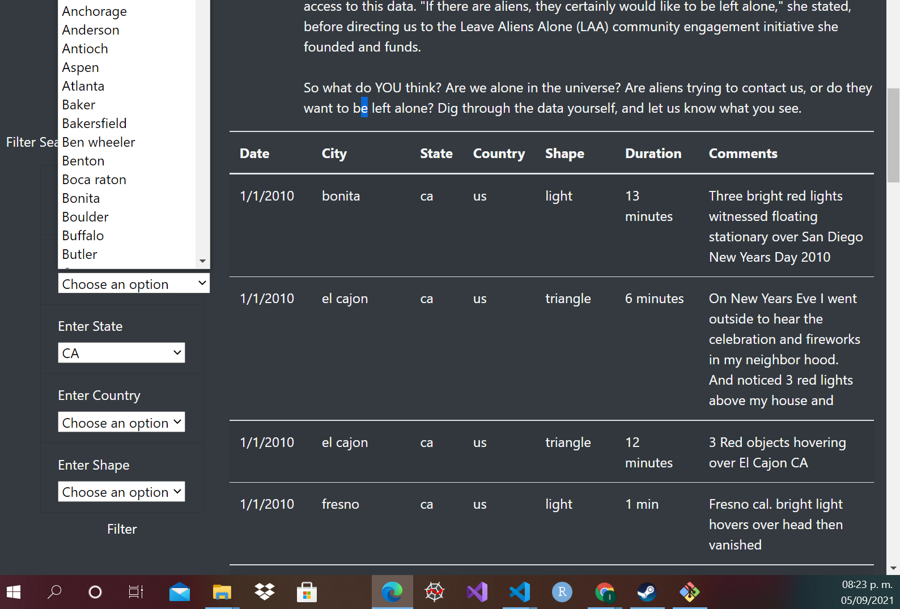
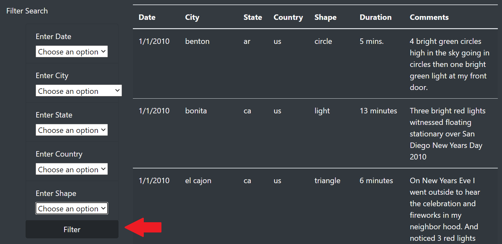

# UFOs
## Overview of Project: 
The purpose of this project is to help a client to organize and manage the data that she has gathered of UFOs sightings with JavaScript and visualize the data in a web page with all the information plus adding some filters to make a search easier.
## Resources
* Data Source: data.js
* Software: Python 3.9.5

## Results: 
In order to display the **UFOs sightings** data, a web page was developed including a functionality to filter the table of sightings by 5 criterions:
* Date
* City
* State
* Country
* Shape

These criterions where placed in the left side of the web page, in order to use them the user needs to write the input to filter the table of sightings on the right, an example of how to write an input of each criterion is shown by a placeholder that gives an example of how to place the parameter. After the user finishes writing in the white box, the table will automatically change, displaying the sightings that fulfill the parameters that the user gave.
## Summary: 
One of the drawbacks of this design is that the user may not know all of the parameter options he has to filter the table of sightings, since there is only one placeholder that gives an example of the format, but it doesn't show options that are not as intuitive, such as the shape of a UFO, so it will be a good idea to replace the white box with an option selector that shows the possible options that the user has.
Another drawback in my point of view, is that there is not a button that allows the user to apply all the filters that he has selected instead of automatically displaying each filter as the user inputs them, so a filter button could make the page more user-friendly.
In the images below, examples of the implementation are displayed.

Option Selector    |  Button for applying filters
:-------------------------:|:-------------------------:
    |  
